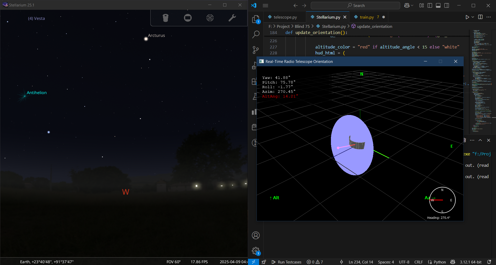

# SkyScope 3D 📡🌌

A real-time 3D radio telescope orientation visualization tool with live UDP telemetry input, interactive 3D model rendering using PyQtGraph, compass + HUD display, and Stellarium synchronization for celestial tracking.

---

## 🔭 Features

- 🧭 **Compass Display**: Real-time azimuth tracking with cardinal direction indicators.
- 🎯 **3D Model**: Interactive OpenGL-based visualization of a dish, receiver arm, and base.
- 📡 **Live UDP Input**: Accepts yaw, pitch, and roll data via UDP (`port 5005`).
- 🛸 **Stellarium Integration**: Sends azimuth and altitude data to Stellarium for synced celestial view.
- 🕶️ **Trail Visualization**: Historical pointing direction rendered as a yellow 3D trail.
- 💡 **Heads-Up Display (HUD)**: Live numeric readouts for yaw, pitch, roll, azimuth, and altitude angle.

## 🚀 How to Run

### 1. Clone the Repository

  bash
  git clone https://github.com/your-username/skyscope-3d.git
  cd skyscope-3d

## 2. Install Dependencies
  pip install pyqt5 pyqtgraph scipy numpy requests

### 3. Launch the App
 python skyscope.py

### 📡 UDP Input Format
   The program listens on UDP port 5005 for messages formatted as:
  <yaw>,<pitch>,<roll>
  All angles in degrees.
  Example:
  120.0,-15.0,3.0
  
### 🌠 Stellarium Sync
  This project integrates with Stellarium using its Remote Control plugin.
  
  Setup Stellarium:
  Open Stellarium.
  
  Enable Remote Control:
  
  Press F2 → Plugins → Remote Control → ✔ Load at Startup → ✔ Enable
  
  Restart Stellarium
  
  Ensure Stellarium is accessible at:
  http://localhost:8090/api/main/view
  
  Result:
  The telescope's azimuth & altitude will update Stellarium's sky view in real-time.

### 🧠 How It Works
  PyQtGraph renders the 3D OpenGL scene.
  
  UDP packets (yaw, pitch, roll) are converted into a 3D rotation matrix using SciPy Rotation.
  
  The orientation is applied to the telescope mesh and sent to Stellarium in radians.
  
  Altitude angle under 15° is highlighted in red as a warning.

### 🛠️ Requirements
  Python 3.7+
  
  PyQt5
  
  PyQtGraph
  
  SciPy
  
  NumPy
  
  Requests (for HTTP to Stellarium)

### 📄 License
  MIT License. Feel free to use and modify.

### ⭐ Star This Repo
  If you find this project helpful, give it a ⭐ on GitHub!

### 🙌 Credits
  PyQtGraph
  
  Stellarium API Docs
  
  SciPy Rotation

  yaml

Let me know if you want help generating sample screenshots automatically or resizing them!

